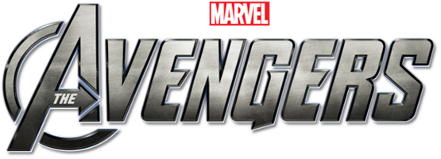

# Avengers Network — 정밀 프롬프트 참조

CLAUDE.md의 각 Step을 정확하게 재현하기 위한 코드 기반 상세 스펙.
시행착오를 줄이고 완성 예시와 동일한 결과를 얻고 싶을 때 사용하세요.

완성 예시: https://avengers-network.netlify.app

---

## Step 1 — 기초 네트워크

```
D3.js v7 CDN으로 avengers_network_data.csv 를 로드해서 Force Simulation 네트워크를 만들어줘.
컬럼: Source, Target, Strength, Type, Source_Group, Source_Importance, Target_Group, Target_Importance
노드 = Source+Target 유니크 값, 링크 = 각 행.
파일 하나(index.html)로 완성. 외부 라이브러리는 CDN만 사용.
```

---

## Step 2 — 디자인

```
아래 디자인 스펙으로 index.html을 업데이트해줘.

배경:
-  로 background.jpg 를 position:fixed, inset:0, z-index:0, object-fit:cover 로 깔기
- 그 위에 <canvas id="stars"> 를 position:fixed, inset:0, z-index:1 로 겹치기
- GLSL 별 파티클: WebGL vertexShader/fragmentShader 로 별 800개, 반짝임(sin(time)) 적용
- SVG는 position:relative, z-index:2

로고:
-  를 좌측 상단 position:fixed, z-index:10, width:120px

노드 색상 (Source_Group 기준):
  Avengers → #e8603c
  Asgardians → #f5c518
  Guardians → #00b4d8
  Wakanda → #6aac98
  Mystic Arts → #9b5de5
  Black Order / Villain → #ef5350
  Supporting / 기타 → #aaa

노드 크기: r = 4 + Source_Importance * 2 (min 6, max 18)
링크 굵기: Strength 에 비례 (scaleLinear domain[1,10] range[0.5,4])
폰트: Google Fonts Cinzel, weight 400/700
```

---

## Step 3 공통 — 프로필 사진 · 로고 · 필터

```
아래 공통 요소를 index.html에 추가해줘.

── 프로필 사진 ──
FACE 객체: 캐릭터 이름(Source 컬럼 값) → images/ 폴더 내 로컬 파일 경로 매핑
  예: "Iron Man" → "images/iron_man.jpg"
  (images/ 폴더에 있는 파일명 기준으로 매핑)

SVG defs 안에 캐릭터별 clipPath(원형) + <image> 선언:
  <clipPath id="clip-{id}"><circle cx="0" cy="0" r="{NODE_R}"/></clipPath>
  <image href="{FACE[id]}" x="-{NODE_R}" y="-{NODE_R}" width="{NODE_R*2}" height="{NODE_R*2}"
         clip-path="url(#clip-{id})" preserveAspectRatio="xMidYMin slice"/>
이니셜 텍스트 폴백 없음 — 이미지 로딩 실패 시 해당 노드는 그냥 빈 원

── 로고 헤더 ──
avengers-logo2.png 를 position:fixed, top:16px, left:20px, width:110px, z-index:10 으로 고정

── 필터 패널 ──
우측 position:fixed, top:50%, transform:translateY(-50%), z-index:10 패널
RELATIONS 그룹: All / ally / enemy / romantic / family 버튼
GROUPS 그룹: All / Avengers / Asgardians / Guardians / Wakanda / Mystic Arts / Villain 버튼
필터 선택 시: 해당 조건을 만족하는 노드+엣지만 opacity:1, 나머지 opacity:0 + pointer-events:none
트랜지션: 모든 opacity 변화는 300ms ease 트랜지션으로 부드럽게
전체(All) 선택 시 모든 노드 복원
```

---

## Step 3(1) — Force Network

```
위 공통 요소에 추가:

드래그:
  d3.drag() — start: alphaTarget(0.3).restart(), d.fx=d.x / drag: d.fx=e.x / end: alphaTarget(0), d.fx=null

호버:
  mouseover → 연결된 노드 opacity:1, 나머지 opacity:0.1 (링크도 동일)
  mouseout → 전체 opacity:1 복원
  트랜지션: 150ms

클릭 정보 카드:
  클릭 시 position:fixed 카드에 이름(Cinzel bold 18px) + 그룹(그룹 컬러) + 연결 수 표시
  (연결 수는 영어 "N Connections", 작고 연하게 — 한글 "연결 수" 금지)
  카드 위치: 클릭한 노드 좌표 기준 우측 16px, 상단 정렬

필터링:
  필터 변경 시 visible 노드 bounding box 계산
  → d3.zoom().transform 으로 해당 영역에 fit (700ms easeCubicInOut)
  전체(All) 복원 시 전체 그래프에 fit
```

---

## Step 3(2) — 360° Chord Diagram

```
위 공통 요소에 추가.
index.html의 Force Simulation을 제거하고 원형 배치로 교체.

── 레이아웃 ──
CIRCLE_R = Math.min(W, H) * 0.36
그룹 정렬 순서: Avengers → Guardians → Asgardians → Wakanda → Mystic Arts → Black Order → Villain → Supporting
같은 그룹 내에서는 Source_Importance 내림차순
baseAngle = -π/2 + 2π * i / N (균등 배치)
원 궤도 가이드: <circle r={CIRCLE_R} fill="none" stroke="rgba(255,255,255,0.07)"/>

── 노드 ──
NODE_R = 18, 모든 노드 동일 크기, 드래그 불가
stroke: none, 흰색 미광 링 rgba(255,255,255,0.18) stroke-width:1

── 엣지 ──
모든 엣지 흰색 <path>, cubic bezier (중심 방향 곡률 0.32)
  cp = 중심(CX, CY) 쪽으로 0.32 비율 이동한 두 제어점
  d = `M ${x1} ${y1} C ${cp1x} ${cp1y} ${cp2x} ${cp2y} ${x2} ${y2}`
타입별 두께/opacity:
  ally 0.7px / 0.18 | enemy 2.2px / 0.28 | romantic 1.1px / 0.22 | family 1.6px / 0.24
strength 보정: strokeWidth * (0.6 + strength * 0.04)

── Spotlight ──
9시(π) 고정. pointer-events:none. SVG 최상단 레이어.
SL_R = NODE_R * 3.2
흰 테두리 링 + <image> clipPath(원형) 으로 얼굴 표시

── 클릭 인터랙션 ──
노드 클릭 시:
1. 미선택 노드 opacity:0.30
2. 모든 엣지 opacity:0 즉시
3. Spotlight 이미지 선택 노드 얼굴로 즉시 교체
4. d3.timer(950ms, easeCubicInOut)로 currentRot 애니메이션 → 선택 노드가 π 위치
5. 스핀 중 매 프레임: getNodeAt9() → 9시 가장 가까운 노드 얼굴로 Spotlight 교체
6. 스핀 완료 → openGap() → shootLines()

openGap():
GAP = Math.asin((SL_R + NODE_R + 12) / CIRCLE_R)
선택 노드는 π 고정, 나머지 노드를 π+GAP ~ π-GAP 바깥 호에 균등 재배치
  others[i].angle = π + GAP + (i + 0.5) * (2π - 2*GAP) / others.length
420ms easeCubicOut 트랜지션

shootLines():
각 연결 엣지의 path를 "선택 노드 → 상대 노드" 방향으로 재구성
stroke-dasharray = totalLength, stroke-dashoffset: totalLength → 0 (650ms easeQuadOut)
연결 엣지 opacity: ally 0.75 / enemy 0.95 / romantic 0.80 / family 0.85
비연결 엣지: opacity 0.03

── 정보 카드 ──
left = (CX - CIRCLE_R) - SL_R - 18 - 185, top = CY - 50
width: 185px, text-align: right
이름(Cinzel bold 22px) + 그룹(그룹 컬러 14px) + 연결 수
  ⚠️ 연결 수는 반드시 영어로 "N Connections" 형식 (예: "3 Connections"). 한글 "연결 수" 금지.
  스타일: 작고 연하게 — 회색(rgba(255,255,255,0.45)) 12px, 노드 이름 아래

── 필터링 ──
visible 노드만으로 baseAngle 재계산
  visNodes[i].baseAngle = -π/2 + 2π*i/M
600ms easeCubicInOut 트랜지션으로 노드 이동, 엣지 opacity도 트랜지션
전체(All): originalAngle 복원
필터 변경 시: currentRot=0, selectedId=null, Spotlight 숨김
```

---

## Step 4 — Tableau Extension (정밀 버전)

```
목표: 완성형 네트워크(index.html)를 "그대로" Tableau 워크시트 Viz 확장으로 만든다.
      → 단순 Force 버전이 아니라, index.html의 풀 디자인이 Tableau 안에서도 똑같이 보이게.

tableau-extension/ 폴더 안에 파일을 만들어줘 (데이터·로직을 분리하면 관리 쉬움):
  - avengers-network.html        (껍데기 + 라이브러리 로드)
  - avengers-network-data.js     (NODES / LINKS / faceImages / group / importance 전부 내장)
  - avengers-network.js          (완성형 렌더 로직)
  manifest.trex

─── 핵심 방침 (완성본 netlify 구조와 동일) ───
1) index.html의 디자인·로직을 그대로 가져온다:
   별 파티클 배경(GLSL/WebGL), Cinzel 폰트, 360° Chord 원형 배치,
   프로필 사진(foreignObject + clipPath 원형 크롭), 9시 Spotlight 스핀,
   RELATIONS/GROUPS 필터 — index.html에 있는 것 전부 포함.
2) 데이터 출처 — 워크시트 우선, 내장은 폴백:
   · Tableau 안: 워크시트에서 읽는다. 인코딩에 Source/Target/Strength/Type,
     세부 정보(Detail)에 Source_Group/Source_Image/Source_Importance 등을 올리면 그대로 반영.
     → 스타워즈 등 다른 데이터도 동작.
   · 데이터 없을 때: 첫 화면 가이드(#empty-state) 표시.
   · 브라우저 단독: 내장 데모 데이터(NODES/LINKS)로 표시 (폴백).

─── 라이브러리 ───
  <script src="https://d3js.org/d3.v7.min.js"></script>
  <script src="https://extensions.tableauusercontent.com/resources/tableau.extensions.1.latest.min.js"></script>
  ※ 옛 CDN(extensionsdk.azureedge.net)은 폐지됨 — 위 tableauusercontent URL 사용

─── 초기화 (⚠️ tableau 존재 가드 필수 — 없으면 "tableau is not defined"로 까만 화면) ───
  const inTableau = (typeof tableau !== "undefined" && tableau.extensions)
  if (inTableau) {
    tableau.extensions.initializeAsync().then(() => {
      const ws = tableau.extensions.worksheetContent.worksheet
      ws.addEventListener(tableau.TableauEventType.SummaryDataChanged, render)  // 필드 변경 시 다시
      render()
    }).catch(() => render())
  } else {
    render()   // 브라우저 단독: 내장 데모로
  }

─── render() ───
  - Tableau + 데이터 있음: getVisualSpecificationAsync()로 인코딩 매핑 +
    getSummaryDataReaderAsync()로 행을 읽어 그린다 (Detail의 Source_Group/Source_Image/Source_Importance도 반영).
  - Tableau + 데이터 없음: showEmptyState(true) — 첫 화면 가이드 표시.
  - 브라우저 단독: 내장 NODES/LINKS 데모.

─── 다른 데이터(스타워즈 등) 대응 — 반드시 지킬 것 ───
  1) 선 굵기 정규화: 데이터의 strength 최대값(maxStrength)으로 나눠서 계산.
     width ∝ Math.pow(s / maxStrength, n)   ← s/10 하드코딩 금지.
     (Tableau가 합계(SUM)로 집계해 값이 10을 넘어도 선이 폭증하지 않게)
  2) 이미지는 데이터에 이미지 URL이 있을 때만 표시:
     faceImages = (이미지 있으면) 데이터이미지 : {}   ← 없을 때 내장 사진 강제 사용 금지
     (어벤져스 사진이 다른 데이터에 잘못 뜨는 것 방지)
  3) 이미지 경로 해석(resolveImageUrl):
     http(s)://·절대·data: → 그대로 / images/foo.jpg 상대경로 → ../로 해석(= 프로젝트 루트/images/)
     → 로컬 이미지 폴더를 쓰는 데이터도 표시됨 (로컬 서버 8080 필요)

─── 필드 배치 (⚠️ 그룹은 인코딩이 아니라 Detail에 — 자주 헷갈림) ───
  - 인코딩 선반(필수): Source / Target / Strength.  Type은 인코딩 또는 Detail 둘 다 가능.
  - 세부 정보(Detail) 셸프: Source_Group / Target_Group(그룹 색), Source_Image / Target_Image(사진),
    Source_Importance / Target_Importance(노드 크기), (필요시 Type).
  - 코드는 워크시트 컬럼을 normalizeFieldName으로 "이름"으로 읽으므로,
    Source_Group 등은 인코딩 선반이 없어도 Detail에 올리기만 하면 자동 반영됨.
  - 즉 "그룹 인코딩 선반"은 만들지 않는다. 그룹은 노드별(source/target) 2개라 Detail이 맞음.
    (Relation Type만 인코딩 선반, Group은 Detail — 이 둘은 위치가 다를 뿐 둘 다 동작)

─── 첫 화면 가이드 (#empty-state) ───
  - Tableau에서 필드 없을 때 표시 (id="empty-state" + hidden 토글, showEmptyState로 제어)
  - 한글 카드형(A Source · B Target · C Strength · D Type, 필수/선택), 폰트 Pretendard
  - 이미지 URL/그룹/중요도를 어디(세부 정보 Detail)에 넣는지까지 안내

⚠️ 까만 화면 / 오작동 원인 (피할 것):
  1) SDK를 폐지된 azureedge에서 로드 → tableauusercontent URL 사용
  2) tableau 가드 없이 호출 → 브라우저에서 스크립트 정지
  3) 굵기 s/10 하드코딩 → 다른 데이터에서 선 폭증 → maxStrength 정규화
  4) 이미지를 startsWith('http')만 받음 → images/ 상대경로 안 뜸 → resolveImageUrl 사용

─── tableau-extension/manifest.trex ───

⚠️ manifest 스키마 규칙 — 아래를 어기면 "구문 분석 오류(FD722608)"가 난다:
  1. 최상위는 <worksheet-extension> (대시보드용 <dashboard-extension> 아님)
  2. <default-settings>·<encodings> 래퍼는 존재하지 않음 → 절대 쓰지 말 것.
     인코딩은 <worksheet-extension> 맨 끝에 <encoding>을 직접 나열.
  3. 각 <encoding>은 비울 수 없음(<encoding id="x"/> 금지) →
     반드시 <display-name> + <role-spec><role-type> + <fields max-count="1"/> 포함.
     (measure 인코딩은 <data-spec><data-type>numeric</data-type> 추가)
  4. <name resource-id="name"/>는 비워두고, 맨 아래 <resources>에서 실제 이름 정의.
  5. min-api-version은 1.11 이상. source-location URL은 localhost:8080.

<?xml version="1.0" encoding="utf-8"?>
<manifest manifest-version="0.1" xmlns="http://www.tableau.com/xml/extension_manifest">
  <worksheet-extension id="com.seoyeon924.avengers-network-local" extension-version="1.0.0">
    <default-locale>ko_KR</default-locale>
    <name resource-id="name"/>
    <description>D3.js 기반 어벤져스 캐릭터 관계 네트워크 (워크시트 Viz 확장)</description>
    <author name="seoyeon924" email="tjdus92422@gmail.com" organization="fastcampus" website="https://avengers-network.netlify.app"/>
    <min-api-version>1.11</min-api-version>
    <source-location>
      <url>http://localhost:8080/tableau-extension/avengers-network.html</url>
    </source-location>
    <icon/>
    <permissions>
      <permission>full data</permission>
    </permissions>

    <encoding id="source">
      <display-name>Source</display-name>
      <role-spec><role-type>discrete-dimension</role-type></role-spec>
      <fields max-count="1"/>
      <tooltip>Source character in the relationship</tooltip>
    </encoding>

    <encoding id="target">
      <display-name>Target</display-name>
      <role-spec><role-type>discrete-dimension</role-type></role-spec>
      <fields max-count="1"/>
      <tooltip>Target character in the relationship</tooltip>
    </encoding>

    <encoding id="strength">
      <display-name>Strength</display-name>
      <data-spec><data-type>numeric</data-type></data-spec>
      <role-spec>
        <role-type>continuous-measure</role-type>
        <role-type>discrete-measure</role-type>
      </role-spec>
      <fields max-count="1"/>
      <tooltip>Relationship strength (1-10)</tooltip>
    </encoding>

    <encoding id="type">
      <display-name>Type</display-name>
      <role-spec><role-type>discrete-dimension</role-type></role-spec>
      <fields max-count="1"/>
      <tooltip>Relationship type (ally, enemy, family, romantic)</tooltip>
    </encoding>
  </worksheet-extension>

  <resources>
    <resource id="name">
      <text locale="ko_KR">Avengers Network</text>
      <text locale="en_US">Avengers Network</text>
    </resource>
  </resources>
</manifest>
```

> **Tableau에서 불러오는 법**:
> 워크시트 → 마크 카드 드롭다운 → "확장 프로그램 추가" → manifest.trex 선택
> → 데이터가 코드에 내장돼 있어 **추가하자마자 완성형 그래프가 그려집니다** (필드 안 올려도 됨).
>   (인코딩 선반 Source/Target/Strength/Type은 선택 — Tableau 데이터와 필터·강조 연동할 때만 사용)
> ※ 대시보드 "확장 프로그램" 개체에 넣으면 에러납니다(93FB5DF9) — 반드시 워크시트 마크 카드에서 추가.
> ※ 로컬 서버 필수: avengers-practice 폴더에서 `python3 -m http.server 8080` 실행 중이어야 함.
>   (서버 없이 배포하려면 source-location을 https 호스팅 URL로 — 예: netlify)
